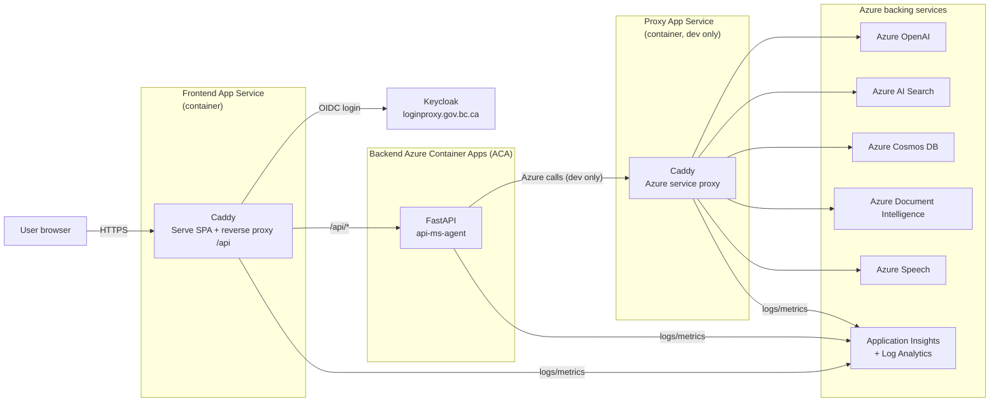
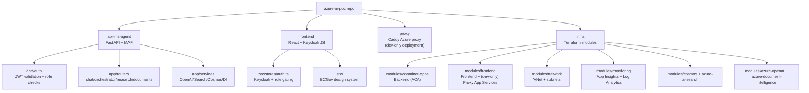
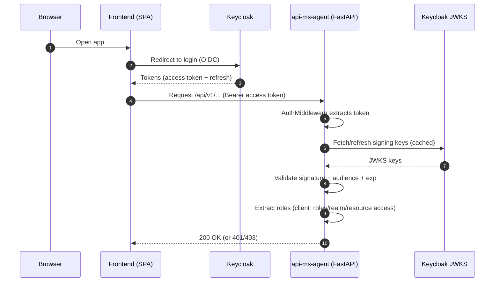
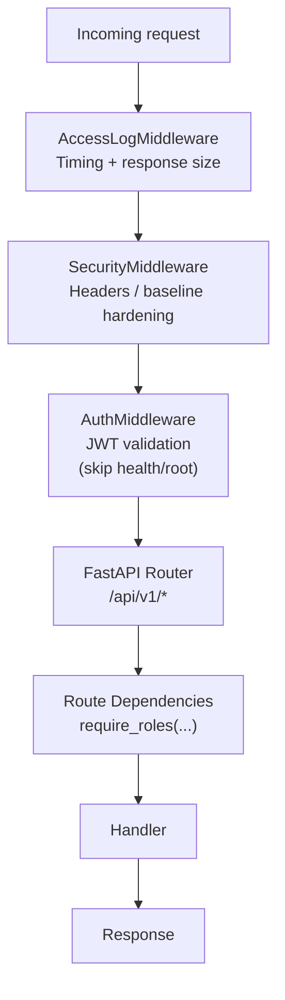
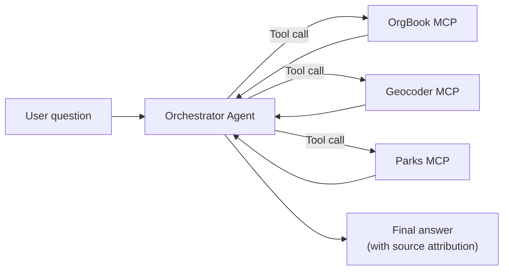
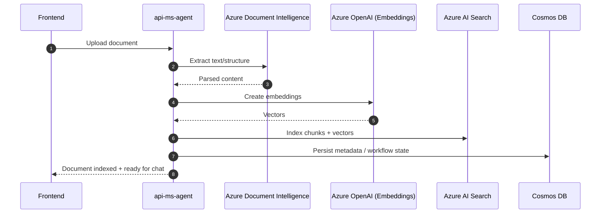
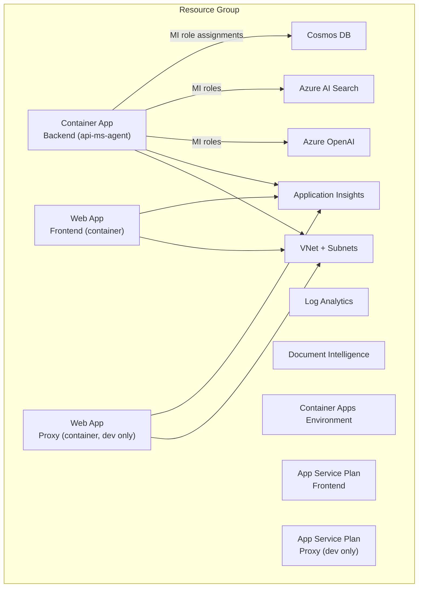

# Azure AI POC – Architecture Demo

This document describes the current product architecture on `main`. The deprecated `api/` (LangChain/LangGraph) service is intentionally excluded.

---

## 1) What this product is

**Azure AI POC** is a multi-agent platform that provides:
- A **React frontend** for user interaction
- A **FastAPI backend** (`api-ms-agent`) built on **Microsoft Agent Framework (MAF)**
- **RAG + document ingestion** using Azure AI Search + Cosmos DB + Document Intelligence
- A **dev-only Caddy proxy** service to enable local development access to Azure PaaS endpoints (private endpoints; no public access outside the VNet)
- **Keycloak-based authentication and role-based authorization**

Primary outcomes:
- The platform separates **UI**, **agent orchestration**, **data layer**, and **cloud service access**.
- The architecture is cloud-ready (containerized) with Terraform-managed Azure resources.

---

## 2) System architecture

### 2.1 Component view

Key behaviors:
- Frontend Caddy serves the SPA and proxies `/api/*` to the backend.
- **Dev only:** Proxy Caddy provides a bridge for local development access to Azure PaaS services that are private-only (private endpoints; no public access outside the VNet).
- Backend handles auth checks, agent orchestration, document ingestion, and RAG.

Note: In non-dev environments, the proxy is not deployed; workloads running inside the VNet access Azure PaaS directly via private endpoints.

### 2.2 Why the proxy exists

The proxy (Caddy) is deployed **only in the Dev environment** to support local development.

Why it exists:
- Azure PaaS services are **private-only** (private endpoints) and have **no public access outside the VNet**.
- The proxy runs inside the VNet and exposes a single, controlled ingress for development calls.
- It provides WebSocket support for **Azure Speech** and consistent timeouts/connection behavior.
- It strips caller-identifying headers (e.g., removes `X-Forwarded-For`, `X-Real-IP`).

---

## 3) Repo tour

Key folders:
- `api-ms-agent/` – the primary backend service
- `frontend/` – React + Keycloak JS integration
- `proxy/` – Caddy reverse proxy to Azure endpoints (**deployed in Dev only** for local development access)
- `infra/` – Terraform modules (network, monitoring, OpenAI, Search, Cosmos, DI, container-apps backend, frontend)

---

## 4) Auth model today (Keycloak)

### 4.1 Frontend auth (Keycloak JS)
- The frontend uses `keycloak-js`.
- The SPA receives and refreshes tokens, and uses role checks for route gating.

### 4.2 Backend auth (JWT validation + role checks)
- `api-ms-agent` validates JWTs using Keycloak JWKS (`/protocol/openid-connect/certs`).
- It validates:
  - JWT signature (RS256)
  - `aud` includes the configured client id
  - `exp` (token expiration)
- It requires a role list (mapped from token claims like `client_roles`, or other Keycloak layouts).

### 4.3 Where authorization is enforced
- **Backend** uses FastAPI dependencies like `require_roles(...)` on protected routes.
- **Frontend** uses role gating for UX/navigation, but the backend remains the source of truth.

---

## 5) Backend runtime pipeline

### 5.1 Middleware order (how a request is processed)

### 5.2 Startup behavior (why it feels “production-ready”)
On startup the backend warms up:
- Cosmos client
- Azure AI Search client
- Document Intelligence client
- Centralized OpenAI clients
- Agent services (Chat / Orchestrator)

This reduces cold-start latency and catches configuration issues early.

---

## 6) What the backend does (capabilities)

This maps directly to the router structure in `api-ms-agent`.

### 6.1 Chat Agent (general Q&A + RAG)
- A conversational endpoint that can optionally ground answers using indexed documents.
- Uses MAF’s built-in agent patterns (no custom ReAct loop required).

### 6.2 Orchestrator Agent (tool-driven BC Gov queries)
- Coordinates tool calls via MCP wrappers.
- Demonstrates deterministic tool selection for gov data sources (OrgBook, Geocoder, Parks).

### 6.3 Workflow Research Agent (deterministic multi-step)
- Planning → Research → Synthesis
- Optional human-in-the-loop approval
- Persists run state in Cosmos DB

---

## 7) Document ingestion + RAG data flow

The platform treats documents as a first-class knowledge source.

**Key architectural point:**
- Search index is optimized for retrieval.
- Cosmos persists application state (chat/workflow/document metadata).

---

## 8) Azure deployment architecture (ACA for backend/API)

### 8.1 What Terraform provisions today
Terraform modules provision:
- Network (VNet + subnets)
- Monitoring (Log Analytics + App Insights)
- Data + AI services
  - Cosmos DB
  - Azure AI Search
  - Azure OpenAI
  - Document Intelligence
- Compute
  - Backend Azure Container Apps (Container Apps Environment + backend Container App)
  - Frontend App Service (Linux container)
  - Proxy App Service (Linux container, **dev only**)

Note: The proxy is deployed in Dev to support local development access to private-only Azure PaaS (private endpoints; no public access outside the VNet).

### 8.2 Identity and access to Azure resources
- Backend Container App uses **System-Assigned Managed Identity** (when enabled).
- Terraform assigns:
  - Cosmos DB SQL role (Data Contributor)
  - Search roles (Index Data Contributor, Reader, etc.)
  - OpenAI roles (User + Contributor)

**What to emphasize:** This reduces the number of static secrets needed in production.

### 8.3 Current posture (what to say in the demo)
- The backend/API has moved to **Azure Container Apps (ACA)**.
- The frontend and the dev-only proxy remain on **App Service (container)**.
- The logical architecture is unchanged: separate deployable units, private networking, managed identity, and centralized observability.

---

## 9) Suggested walkthrough order

1) System architecture (Section 2)
2) Repo tour (Section 3)
3) Auth model today (Section 4)
4) Capabilities (Section 6)
5) Document ingestion + RAG flow (Section 7)
6) Azure deployment posture (Section 8)
